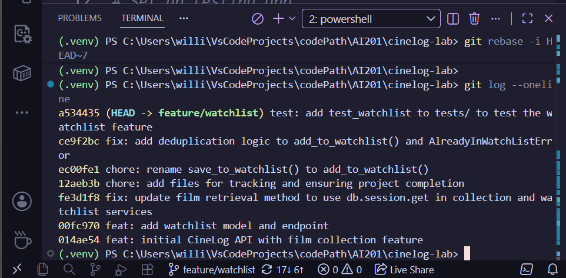

# PR Response Doc — CineLog Watchlist Feature

## AI Usage
<!-- Fill in at the end — how you used AI tools during this project -->

Used AI (Gemini) twice

**1: Checking rewording of git commit**
*Question:* Do these commit messages follow conventional commit format? Are any messages bundling multiple logical changes that should be separate commits?

3a077c9 (HEAD -> feature/watchlist) test: added test_watchlist to tests/ to test the watchlist feature. Tests test_add_to_watchlist_duplicate_raises and test_add_to_watchlist_nonexistant_film_raises were added.
b146e8d fix: Deduplication logic added to add_to_watchlist() from services/watchlist_service.py. AlreadyInWatchListError error created to handle when film is already in watchlist
3dd639d chore: Renamed save_to_watchlist() to add_to_watchlist() to match other function nameing conventions such as add_to_collection()
7c38240 chore: added files for tracking and ensuring project completion
7c37bcd (upstream/feature/watchlist) fix: update film retrieval method to use db.session.get in collection and watchlist services
ec90edb added watchlist model and endpoint fixed a bug more changes

*Result:* I was given tips and told about formatting issues. I corrected them and I am left with the oneline I have now.

**2: Figuring out what to do with COMMIT_EDITMSG file since I thought I could change on the same page I edit which commits to bring with the rebase**
*Question:* what is the COMMIT_EDITMSG file that opens up after I already "reworded" my commits and "dropped" the ones I wanted to remove?

*Result:* I learned that the commit message is edited in a seperate "file step". I reflected the edits I made in the commit picking stage in the commit messages, one by one.

## Comment 1 — Rename
**What I did:** I renamed function and function calls for save_to_watchlis() to add_to_watchlist().
**How I verified:** I verified the renaming was thorough by searching for the old name (save_to_watchlist) throughout the codebase on feature/watchlist branch.

## Comment 2 — Deduplication
**What I did:** I added the same deduplication logic from add_to_collection() to add_to_watchlist(). Another error was added called AlreadyInWatchlistError for the deduplication scenario where a user tries to add a film to their watchlist and the same film had already been added.
**How I verified:** Deduplication correction was tested using a newly added test "test_add_to_watchlist_duplicate_raises", added to tests/test_watchlist.py. Test passed.

## Comment 3 — Missing test
**What I did:** Created file tests/test_watchlist.py and pulled over logic from tests/test_collection.py. Tests that were added are test_add_to_watchlist_duplicate_raises() and test_add_to_watchlist_nonexistent_film_raises().
**How I verified:** Tests verified by running them. They both passed.

## Comment 4 — Default visibility
**My position:** The default public visibility is a valid decision.
**Reasoning:** These watchlists can be private if chosen as such, but CineLog is much more of a useful tool if friends and family can also see what you have watched or intend to watch. Leaving the visibility public by default is not a security issue therefore, sharable film lists become much more desireable.
**Tradeoff acknowledged:** Anyone can view your list meaning you can not hide the films you have watched or intend to watch, unless you delete the film entry.

## Comment 5 — Sort order
**My position:** I agree with the maintainer, watchlists should be sorted defaultly by date added, rather than alphabetical order.
**Reasoning:** This is the best decision for users that frequently check their watchlist to see what to watch next. They will be greeted with what they recently added, which works even better if the user adds films, watches the ones added, and adds some more films. The user can chronologically look at what they have been attempting to watch and, in their head, know which from the list has already been seen.
**Engagement with reviewer's point:** I completely agree with the reviewer/maintainer.

## Comment 6 — Rebase
**What conflicted:** what files to ignore in gitignore
**How I resolved it:** I accepted the incoming changes (the ones I made) since the project asked me to make the gitignore. Many of the files were the same, only one wasn't.
**How I verified no conflict remains:**I committed a small change to check whether there is still a conflict.

Polished Rebase one-liner:

## PR Description
<!-- Written at the end — feature overview, design decisions, manual testing steps -->

Watchlist feature added to CineLog. It allows users to log films that they plan to watch.

The watchlist is in descending order based on the date the film was added, allowing users to instantly see their newly added titles first.

Similar to collections, visibility is defaulted to public since there is no security risk and users may want to share and check other's list.

In order to test watchlist feature run tests/test_watchlist.py which includes a test on deduplication flag and nonexistent flag: pytest tests/test_watchlist.py -v